# Adaptive-RAG Cascade — Comprehensive Evaluation Overview

> **7 iterations × 3 models × 6 datasets = 3,000 questions per model per iteration**
>
> Models: **Flan-T5-XL**, **Flan-T5-XXL**, **GPT (silver labels from gpt-oss-20b)**
> Datasets: MuSiQue, HotpotQA, 2WikiMHQA, NQ, TriviaQA, SQuAD (500 questions each)

---

## Table of Contents

1. [Executive Summary](#1-executive-summary)
2. [Iteration Overview](#2-iteration-overview)
3. [Macro-Level Results](#3-macro-level-results)
4. [Per-Dataset Analysis](#4-per-dataset-analysis)
5. [Routing & Efficiency](#5-routing--efficiency)
6. [Classifier Performance](#6-classifier-performance)
7. [Training-Free Approaches (IT5–IT7)](#7-training-free-approaches-it5it7)
8. [IT6: κ(q) Feature Probe](#8-it6-κq-feature-probe)
9. [Key Findings & Recommendations](#9-key-findings--recommendations)

---

## 1. Executive Summary

| Model | Best Iteration | Best Macro F1 | Best Macro EM | Fewest Steps |
|-------|---------------|---------------|---------------|--------------|
| Flan-T5-XL | **IT5** (Agreement Gate) | **0.4851** | **0.3867** | IT7: 2,870 |
| Flan-T5-XXL | **IT5** (Agreement Gate) | **0.5056** | **0.4060** | IT7: 2,543 |
| GPT | **IT4** (Focal Loss) | **0.5204** | **0.3897** | IT7: 1,908 |

**Key takeaway:** The training-free agreement gate (IT5) delivers the best quality for Flan-T5 models, improving macro F1 by **+2.5 pp** (XL) and **+3.4 pp** (XXL) over the IT1 baseline. For GPT, the trained focal-loss classifier (IT4) edges ahead on F1 (+0.58 pp), while IT5 hurts GPT's single-hop datasets (NQ, TriviaQA). The fully training-free UE kappa system (IT7) offers the lowest retrieval cost but at a significant quality penalty for multi-hop datasets.

---

## 2. Iteration Overview

| Iter | Name | Gate 1 (Clf1 / no-ret vs ret) | Gate 2 (Clf2 / single vs multi) | Training Required |
|------|------|-------------------------------|----------------------------------|-------------------|
| IT1 | Baseline Cascade | Standard Clf1 | Standard Clf2 | Yes (Clf1 + Clf2) |
| IT2 | Clf1 Undersampling | Undersampled Clf1 (GPT only) | Standard Clf2 | Yes (Clf1) |
| IT3 | Weighted Cross-Entropy | Weighted CE Clf1 | Standard Clf2 | Yes (Clf1) |
| IT4 | Focal Loss | Focal Clf1 | Standard Clf2 | Yes (Clf1) |
| IT5 | Agreement Gate | UE agreement (training-free) | Standard Clf2 | Clf2 only |
| IT6 | κ(q) Feature Probe | — (diagnostic) | — (diagnostic) | None (analysis) |
| IT7 | UE Kappa | UE agreement (training-free) | κ(q) threshold (training-free) | None |

---

## 3. Macro-Level Results

### 3.1 Macro-Avg F1 Progression

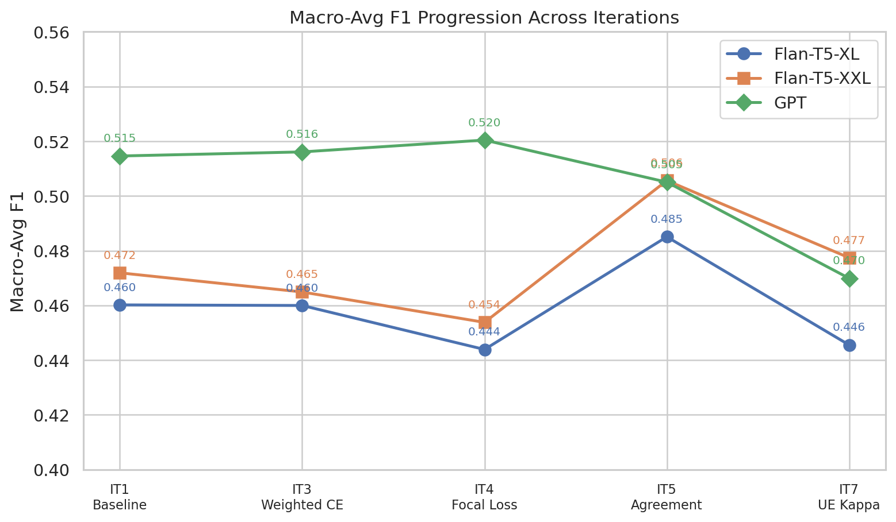

The line chart reveals three distinct model trajectories:
- **GPT** starts highest (0.515) and remains relatively flat across classifier-tuning iterations (IT3/IT4), but drops at IT5 (−0.010) due to over-routing single-hop questions to retrieval.
- **Flan-T5-XXL** benefits most from the agreement gate: IT5 lifts F1 from 0.472 → 0.506 (+3.4 pp).
- **Flan-T5-XL** shows a similar IT5 boost (0.460 → 0.485, +2.5 pp) but collapses at IT7 (0.446).

### 3.2 Macro-Avg F1 & EM (Grouped Bar)

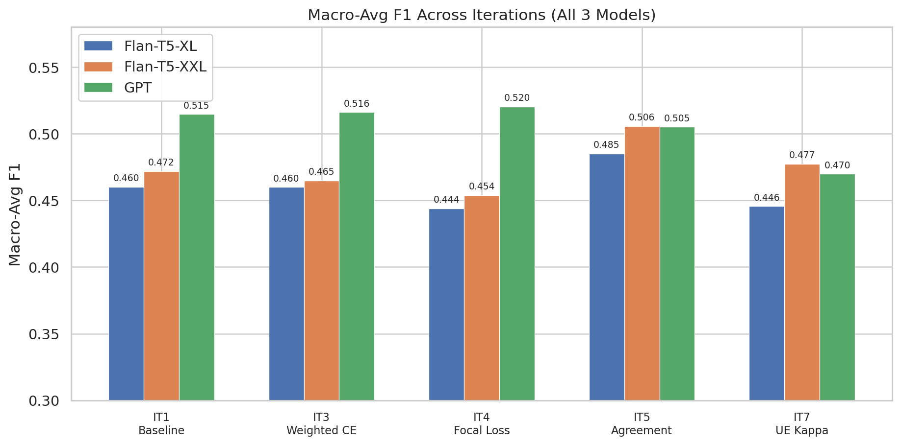

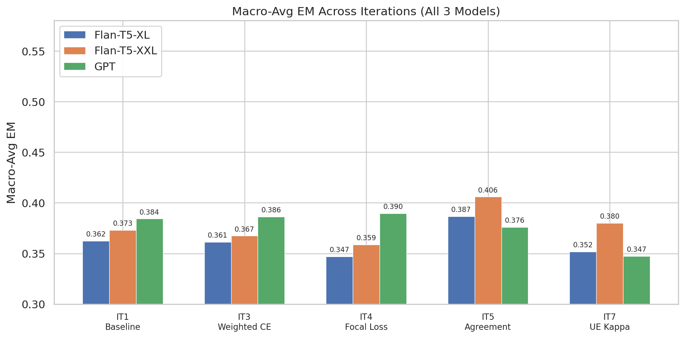

**Observations:**
- IT5 is the only iteration that improves **all three models on EM** vs baseline (XL: +2.4 pp, XXL: +3.3 pp, GPT: −0.8 pp on F1 but note per-dataset variance).
- Focal loss (IT4) actually *hurts* Flan-T5 models (XL: −1.6 pp, XXL: −1.8 pp) but helps GPT (+0.6 pp).
- IT7 (fully training-free) is competitive for Flan-T5-XXL (F1 0.477, only −0.028 vs IT5) but degrades multi-hop performance significantly.

---

## 4. Per-Dataset Analysis

### 4.1 Exact Match Heatmaps

#### Flan-T5-XL
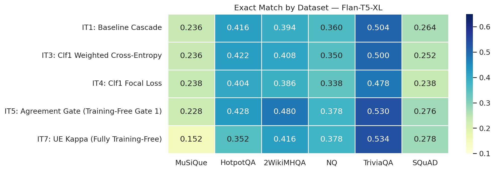

#### Flan-T5-XXL
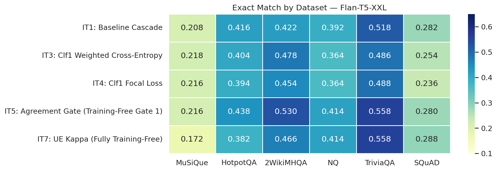

#### GPT
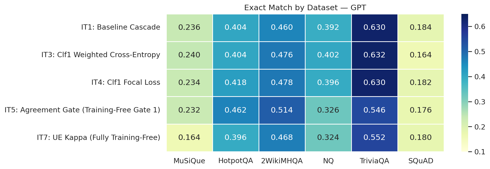

### 4.2 F1 Heatmaps

#### Flan-T5-XL
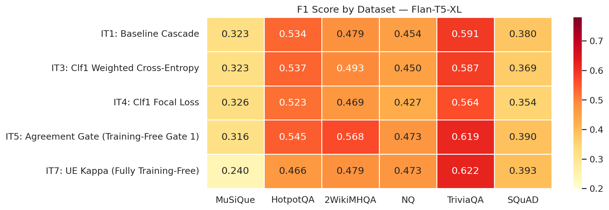

#### Flan-T5-XXL
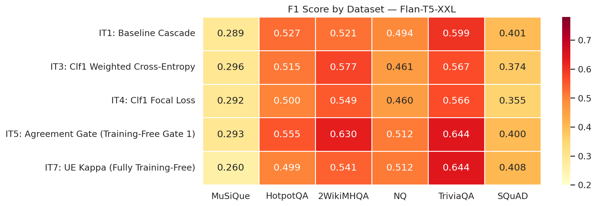

#### GPT
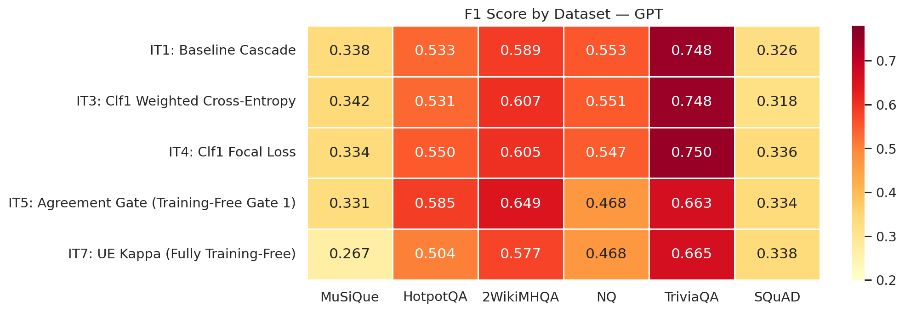

### 4.3 Per-Dataset Patterns

| Dataset | Difficulty | Winner (XL) | Winner (XXL) | Winner (GPT) | Key Pattern |
|---------|-----------|-------------|-------------|-------------|-------------|
| MuSiQue | Hard multi-hop | IT1/IT3 (0.236) | IT3 (0.218) | IT3 (0.240) | Hardest dataset; all iterations struggle. Agreement gate gives no benefit here. |
| HotpotQA | Medium multi-hop | **IT5 (0.428)** | **IT5 (0.438)** | **IT5 (0.462)** | Agreement gate universally wins. Best absolute gain on this dataset. |
| 2WikiMHQA | Medium multi-hop | **IT5 (0.480)** | **IT5 (0.530)** | **IT5 (0.514)** | Largest single-dataset improvement: +8.6 pp (XL), +10.8 pp (XXL), +5.4 pp (GPT) vs IT1. |
| NQ | Single-hop | IT1 (0.360) | IT5 (0.414) | IT3 (0.402) | GPT's IT5 drops −6.6 pp vs IT1 (over-routing to retrieval). |
| TriviaQA | Single-hop | **IT5 (0.530)** | **IT5 (0.558)** | IT1 (0.630) | GPT IT5 loses −8.4 pp; Flan models gain. |
| SQuAD | Single-hop | **IT5 (0.276)** | IT1/IT5 (0.282/0.280) | IT1 (0.184) | Marginal; SQuAD is the weakest dataset across all models. |

**Critical insight:** The agreement gate (IT5) systematically improves **multi-hop** datasets (2WikiMHQA, HotpotQA) at the expense of **single-hop** datasets for GPT. For Flan-T5 models, IT5 improves almost everywhere.

---

## 5. Routing & Efficiency

### 5.1 Route Distributions

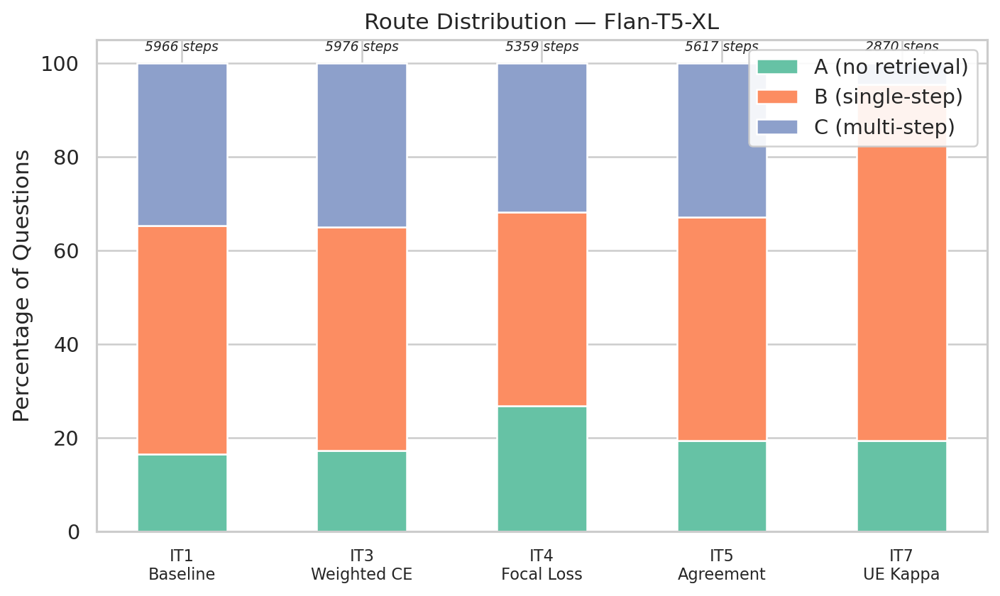

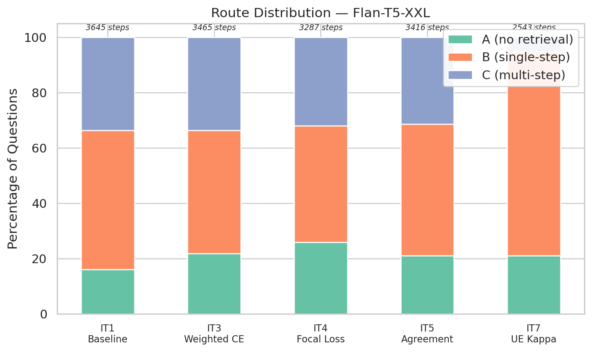

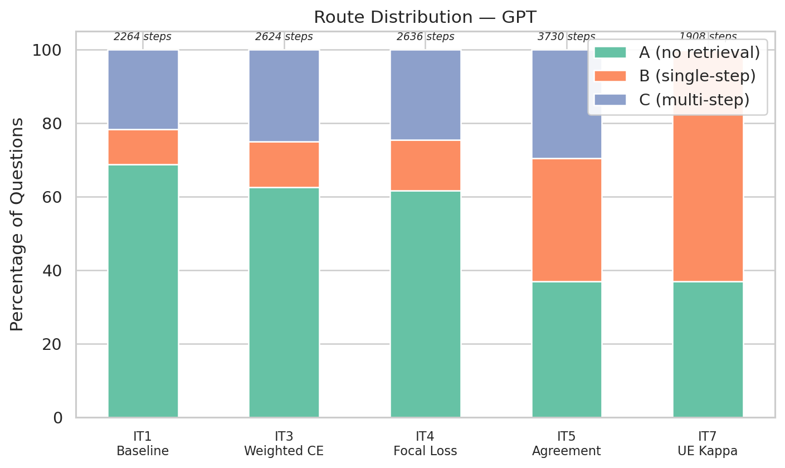

### 5.2 Routing Summary Table

| Iter | Model | A (no-ret) | B (single) | C (multi) | Total Steps |
|------|-------|-----------|-----------|-----------|-------------|
| IT1 | XL | 16.4% | 48.9% | 34.7% | 5,966 |
| IT1 | XXL | 16.0% | 50.3% | 33.7% | 3,645 |
| IT1 | GPT | 68.7% | 9.6% | 21.7% | 2,264 |
| IT5 | XL | 19.4% | 47.6% | 33.0% | 5,617 |
| IT5 | XXL | 21.0% | 47.6% | 31.4% | 3,416 |
| IT5 | GPT | 36.9% | 33.5% | 29.6% | 3,730 |
| IT7 | XL | 19.4% | 76.0% | 4.6% | 2,870 |
| IT7 | XXL | 21.0% | 73.8% | 5.2% | 2,543 |
| IT7 | GPT | 36.9% | 62.9% | 0.2% | 1,908 |

**Key observations:**
- **GPT baseline (IT1)** routes 68.7% of questions to A (no retrieval), vastly over-predicting "no retrieval needed". This is due to the class imbalance in GPT silver labels.
- **IT5 (agreement gate)** partially corrects GPT's over-routing: A drops from 68.7% → 36.9%, redistributing to B and C.
- **IT7 (UE kappa)** nearly eliminates route C (multi-step retrieval): only 4.6% for XL, 5.2% for XXL, **0.2% for GPT**. This explains IT7's multi-hop degradation — the κ threshold is too aggressive.

### 5.3 Efficiency Frontier

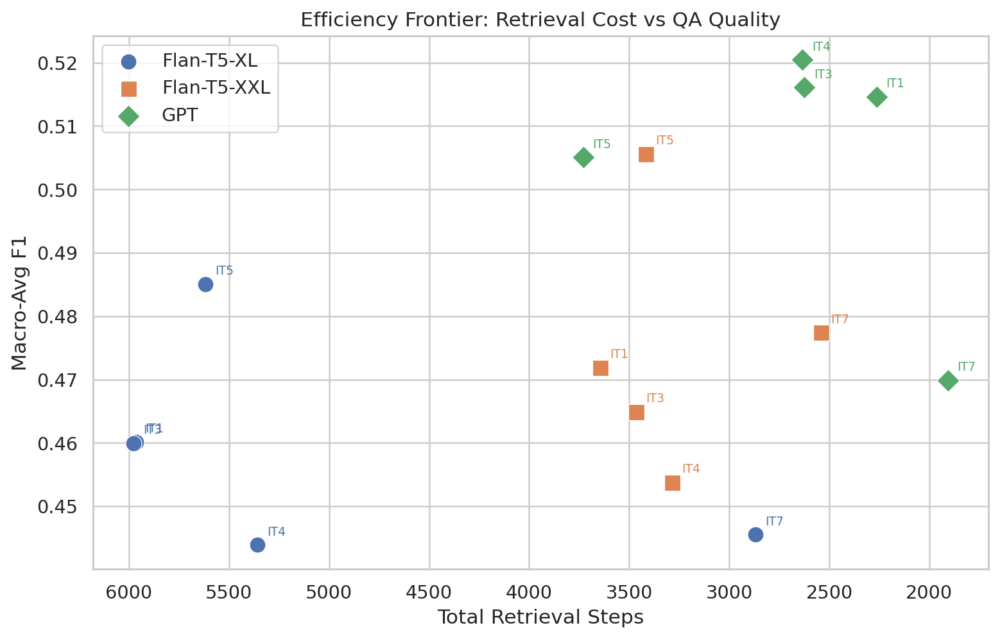

The efficiency frontier shows the trade-off between retrieval cost (total steps) and QA quality:
- **GPT IT4** (Focal) sits at the Pareto frontier: high F1 (0.520) with moderate cost (2,636 steps).
- **Flan-T5-XL IT5** achieves the best XL quality (F1 0.485) but at the highest step count (5,617).
- **GPT IT7** offers the cheapest option (1,908 steps) but sacrifices −4.5 pp F1 vs IT1.
- **Flan-T5-XXL IT5** provides the best overall quality-to-cost ratio among Flan models (F1 0.506, 3,416 steps).

---

## 6. Classifier Performance

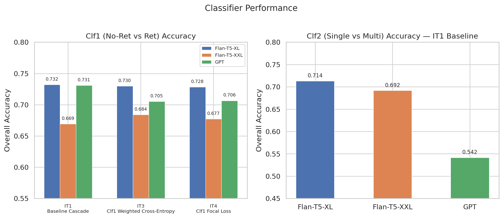

### 6.1 Clf1 (No-Retrieval vs Retrieval)

| Model | IT1 (Std) | IT3 (Wt CE) | IT4 (Focal) | Per-Class Pattern |
|-------|-----------|-------------|-------------|-------------------|
| XL | 0.732 | 0.730 | 0.728 | A: 48.7%, R: 85.0% → Biased toward R |
| XXL | 0.669 | 0.684 | 0.677 | A: 39.9%, R: 82.6% → Strongest R bias |
| GPT | 0.731 | 0.705 | 0.706 | A: 87.0%, R: 36.4% → Inverted: biased toward A |

**GPT's inverted bias** is the root cause of its routing pathology: the classifier predicts "no retrieval" for 87% of A-class samples but only catches 36% of R-class. This stems from the GPT silver label distribution being skewed toward A (1,038 A vs 393 R in the test set).

### 6.2 Clf2 (Single-step vs Multi-step)

| Model | IT1 Accuracy | B Accuracy | C Accuracy |
|-------|-------------|-----------|-----------|
| XL | 0.714 | 71.9% | 69.5% |
| XXL | 0.692 | 70.2% | 65.6% |
| GPT | 0.542 | 48.2% | 67.8% |

GPT's Clf2 is weakest (54.2% overall) with only 393 training samples — a direct consequence of Clf1's aggressive A-routing leaving few samples for the second stage.

---

## 7. Training-Free Approaches (IT5–IT7)

### 7.1 IT5: Agreement Gate — Delta vs Baseline

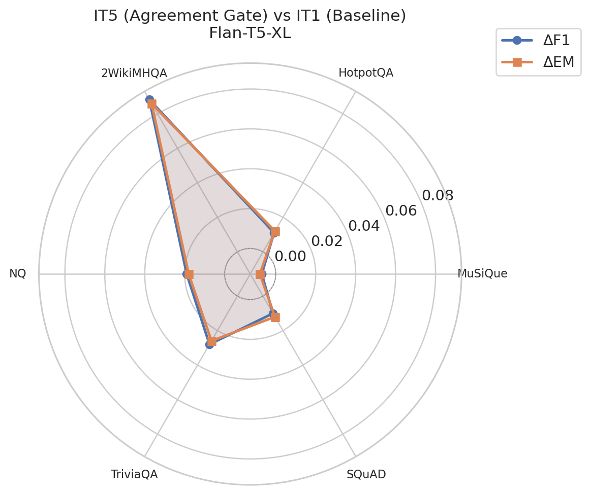

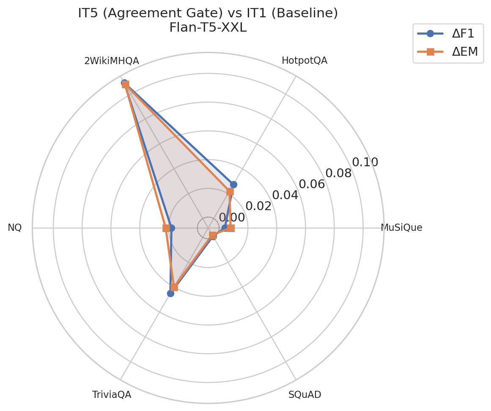

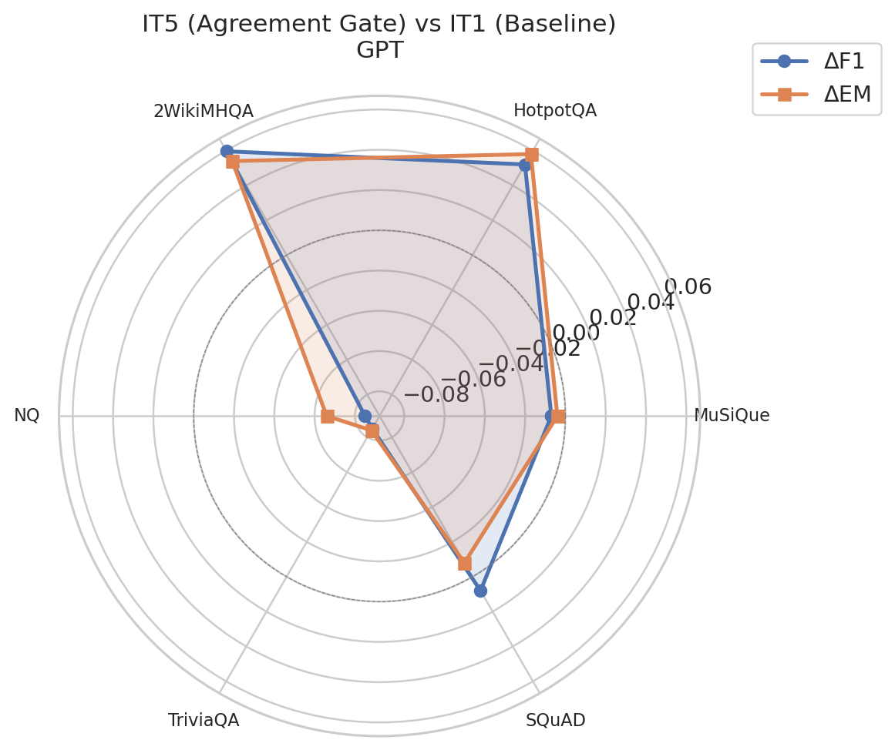

The radar charts show the per-dataset delta (F1 and EM) of IT5 vs IT1:

- **Flan-T5-XL/XXL:** Positive deltas on most datasets, with **2WikiMHQA** showing the largest gain (+8.8%/+10.9% F1). Only MuSiQue is slightly negative.
- **GPT:** Mixed picture. Large gains on HotpotQA (+5.2% F1) and 2WikiMHQA (+6.0% F1) but large losses on NQ (−8.5%) and TriviaQA (−8.5%).

### 7.2 IT5 Agreement Rates

| Model | Overall Rate | Lowest (MuSiQue) | Highest (TriviaQA/2Wiki) |
|-------|-------------|-------------------|--------------------------|
| XL | 19.4% | 9.6% | 36.0% (2Wiki) |
| XXL | 21.0% | 7.4% | 33.2% (2Wiki) |
| GPT | 36.9% | 20.4% | 58.0% (TriviaQA) |

GPT has a much higher agreement rate (36.9%) than the Flan models (~20%). This makes sense — GPT's no-retrieval answers are higher quality, so more answers match across retrieval strategies.

### 7.3 IT7: UE Kappa — Fully Training-Free

IT7 replaces Clf2 with a κ(q)-based threshold, making the entire pipeline training-free. Results:

| Model | IT7 F1 | IT5 F1 | Δ (IT7−IT5) | IT7 Steps | IT5 Steps |
|-------|--------|--------|-------------|-----------|-----------|
| XL | 0.446 | 0.485 | **−3.95 pp** | 2,870 | 5,617 |
| XXL | 0.477 | 0.506 | **−2.82 pp** | 2,543 | 3,416 |
| GPT | 0.470 | 0.505 | **−3.52 pp** | 1,908 | 3,730 |

IT7 trades ~3 pp F1 for a ~49% reduction in retrieval steps. The κ threshold is tuned for accuracy, which makes it nearly eliminate C-routing (multi-step). This is the core weakness: almost everything goes to B (single-step), which is insufficient for genuinely complex questions.

### 7.4 IT7 κ(q) Threshold Details

| Model | Threshold | Val Accuracy | Val Macro-F1 | Val B Acc | Val C Acc |
|-------|-----------|-------------|-------------|-----------|-----------|
| XL | 0.459 | 74.2% | 0.484 | 95.5% | 7.3% |
| XXL | 0.458 | 75.4% | 0.474 | 94.9% | 5.6% |
| GPT | 0.693 | 68.7% | 0.468 | 96.0% | 7.4% |

The high thresholds mean almost everything is classified as B. The accuracy-optimized threshold creates a degenerate classifier that achieves high B-recall at the expense of near-zero C-recall.

---

## 8. IT6: κ(q) Feature Probe

IT6 is a diagnostic iteration that evaluates whether the κ(q) feature (combining token length, entity density, hop density) can predict the B/C boundary.

### 8.1 Logistic Regression Coefficients

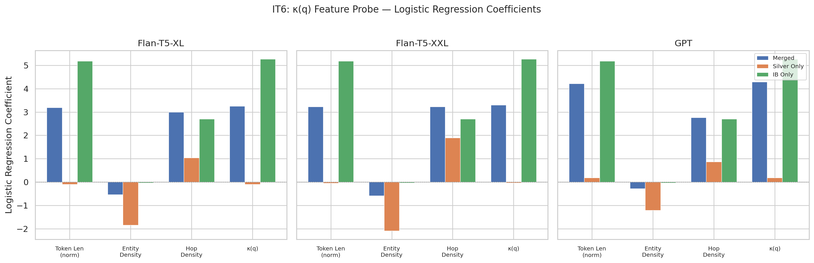

**Key patterns:**
- On **IB (intrinsic benchmark) data** — where labels are ground-truth — κ(q) has the largest coefficient (~5.27), followed by token_len_norm (~5.19). The probe achieves macro-F1 of **0.685** and ROC-AUC of **0.752**.
- On **silver-only data** (classifier-derived labels), κ(q) drops to near-zero (<0.19), and entity_density dominates with a *negative* coefficient. The probe essentially collapses to majority-class prediction (B recall ≈ 100%, C recall ≈ 0%).
- On **merged data**, κ(q) recovers somewhat (coeff ~3.3–4.3) because the IB portion anchors the signal.

### 8.2 Probe Performance Metrics

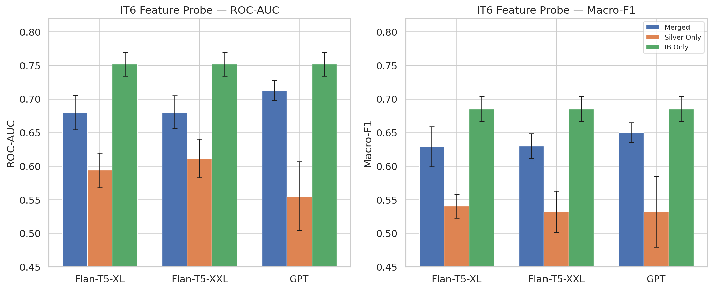

| Split | Macro-F1 | ROC-AUC | Verdict |
|-------|----------|---------|---------|
| IB Only | 0.685 ± 0.019 | 0.752 ± 0.018 | **GO** — κ(q) is informative |
| Merged | 0.629–0.650 ± 0.015–0.030 | 0.680–0.713 ± 0.015–0.025 | **GO** — usable |
| Silver Only | 0.531–0.540 ± 0.018–0.053 | 0.555–0.611 ± 0.026–0.051 | **NO-GO** — noise dominates |

**Conclusion:** κ(q) is a strong feature for the B/C boundary when ground-truth labels are available (IB), but silver labels introduce too much noise for it to be effective alone. This explains IT7's reliance on an accuracy-optimized threshold that defaults to B.

---

## 9. Key Findings & Recommendations

### 9.1 What Worked

1. **Agreement Gate (IT5)** is the single most effective intervention for Flan-T5 models, improving macro F1 by +2.5 to +3.4 pp while being training-free for Gate 1.
2. **2WikiMHQA** sees the largest gains across all models and iterations, suggesting the baseline was most under-serving this dataset.
3. **Focal Loss (IT4)** is the best trained approach for GPT, achieving the highest overall F1 (0.520).
4. **κ(q) feature** is genuinely informative on IB data (ROC-AUC 0.752), validating the theoretical motivation.

### 9.2 What Didn't Work

1. **Undersampling (IT2)** marginally hurts GPT (−0.5 pp F1) and wasn't tested on Flan models.
2. **Focal Loss (IT4)** hurts Flan-T5 models (−1.5 to −1.8 pp), likely because shifting probability mass toward the A class reduces single-hop dataset performance.
3. **UE Kappa (IT7)** over-routes to B, nearly eliminating C-routing. The accuracy-tuned threshold creates a degenerate classifier.
4. **Silver labels** are too noisy for the κ(q) probe (IT6 NO-GO verdict), limiting the fully training-free pipeline.

### 9.3 Recommendations

| Priority | Recommendation | Expected Impact |
|----------|---------------|-----------------|
| High | Use **IT5 (Agreement Gate + Standard Clf2)** as the production pipeline for Flan-T5 models | +2.5–3.4 pp F1 over baseline |
| High | For GPT, use **IT4 (Focal Loss Clf1 + Standard Clf2)** | +0.6 pp F1, good efficiency |
| Medium | Tune IT7's κ threshold for **macro-F1 instead of accuracy** to preserve C-routing | Could recover ~1–2 pp on multi-hop |
| Medium | Investigate per-dataset or per-difficulty agreement gates to prevent GPT's NQ/TriviaQA regression | Reduce IT5's single-hop penalty for GPT |
| Low | Collect more GPT silver labels for Clf2 training (currently only 393 samples) | Improve GPT's Clf2 from 54.2% |

### 9.4 GPT IT2 Comparison (Supplementary)

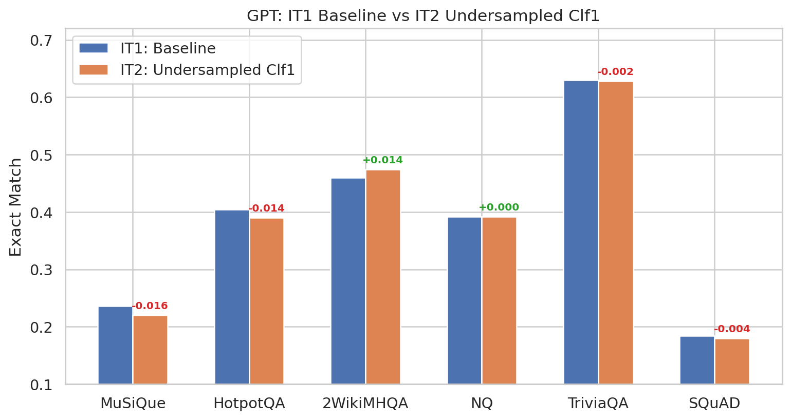

IT2 (undersampling) was GPT-only and shows minor mixed effects: +1.4 pp on 2WikiMHQA but −1.6 pp on MuSiQue. Overall macro delta: −0.5 pp F1, −0.4 pp EM. Not recommended.

---

## Appendix: Chart Index

| Chart | File | Description |
|-------|------|-------------|
| Macro F1 Line | `charts/macro_f1_line.png` | F1 progression across iterations |
| Macro F1 Bar | `charts/macro_macro_avg_f1.png` | Grouped bar: F1 by iteration × model |
| Macro EM Bar | `charts/macro_macro_avg_em.png` | Grouped bar: EM by iteration × model |
| EM Heatmap (×3) | `charts/heatmap_em_{model}.png` | Per-dataset EM for each model |
| F1 Heatmap (×3) | `charts/heatmap_f1_{model}.png` | Per-dataset F1 for each model |
| Routing (×3) | `charts/routing_{model}.png` | Stacked bar: A/B/C route distribution |
| Radar IT5 (×3) | `charts/radar_IT5_vs_IT1_{model}.png` | Per-dataset delta (IT5 vs IT1) |
| Classifier Acc | `charts/classifier_accuracy.png` | Clf1 + Clf2 accuracy comparison |
| Efficiency | `charts/efficiency_frontier.png` | Steps vs F1 scatter plot |
| κ Coefficients | `charts/kappa_probe_coefficients.png` | IT6 logistic regression coefficients |
| κ Metrics | `charts/kappa_probe_metrics.png` | IT6 ROC-AUC and Macro-F1 |
| GPT IT2 | `charts/gpt_it2_comparison.png` | GPT IT1 vs IT2 per-dataset EM |
| Summary Table | `charts/summary_table.png` | Best iteration per model |

---

*Generated from `results/all_iterations.json` — regenerate charts with `python results/generate_charts.py`*
